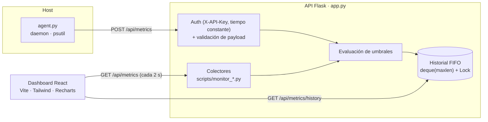

[English](README.md) | **Español**

# Sys-Monitor

Monitoreo del host en tiempo real: un agente con `psutil`, una API Flask autenticada y un
dashboard en React.

[](https://github.com/DiegoTepichin/sys-monitor/actions/workflows/ci.yml)


[](LICENSE)

<!-- TODO: screenshot — agrega docs/screenshot.png y descomenta la línea siguiente -->
<!--  -->

## Por qué

Cuando una máquina se pone lenta, la primera pregunta es _"¿qué está haciendo ahora mismo?"_.
Prometheus + Grafana lo resuelven a escala, pero son mucho que operar para un solo servidor, un
homelab o una máquina de desarrollo. Sys-Monitor es una alternativa pequeña y autocontenida:

- **Vista en vivo** de CPU (uso, load average, frecuencia), memoria y swap, uso de disco y
  throughput de lectura/escritura, throughput de red y los procesos con más CPU.
- **Alertas por umbral** de CPU, memoria y disco, con un estado general `healthy` / `warning`.
- **Ingesta autenticada**: un agente envía snapshots por HTTP con una API key.
- **Un solo contenedor** para desplegar: `docker compose up`.

## Arquitectura



| Componente             | Responsabilidad                                                                                                                                                                                                                |
| ---------------------- | ------------------------------------------------------------------------------------------------------------------------------------------------------------------------------------------------------------------------------ |
| `scripts/monitor_*.py` | Colectores. **Nunca lanzan excepciones**: cada uno devuelve un dict con clave `error`, así un sensor que falla no tumba el servicio. Disco y red calculan throughput con deltas de contadores protegidos por `threading.Lock`. |
| `agent.py`             | Daemon que recolecta cada `POLL_INTERVAL` segundos y hace POST con `X-API-Key`. Sobrevive a caídas del servidor y reintenta en el siguiente ciclo.                                                                             |
| `app.py`               | API Flask: verificación de la key en tiempo constante, validación de esquema, alertas por umbral, historial acotado thread-safe, y sirve el dashboard compilado en producción.                                                 |
| `frontend/`            | Dashboard React 19: tarjetas KPI animadas, gráfica de tendencia CPU/RAM y tabla de procesos con búsqueda.                                                                                                                      |

## Inicio rápido

Requisitos: Python 3.11+, Node 22+.

```sh
git clone https://github.com/DiegoTepichin/sys-monitor.git && cd sys-monitor
python3 -m venv venv && source venv/bin/activate && pip install -r requirements.txt
(cd frontend && npm ci && npm run build)
echo "API_KEY=$(openssl rand -hex 32)" > .env
python app.py & python agent.py
```

Abre <http://localhost:5002>. Flask sirve el dashboard compilado y el agente envía un snapshot
cada 5 segundos. Detén ambos con `Ctrl+C` y luego `kill %1`.

Para desarrollar el frontend con hot reload, ejecuta `cd frontend && npm run dev` y abre
<http://localhost:3000> (Vite redirige `/api` a `:5002`).

### Docker

```sh
docker compose up --build
```

Abre <http://localhost:5002>. La imagen compila el dashboard, lo ejecuta con gunicorn como
usuario sin privilegios y define un `HEALTHCHECK` sobre `/api/health`.

> Dentro de un contenedor, `psutil` ve el **contenedor**, no el host: verás solo un par de
> procesos. Para monitorear una máquina real, usa el inicio rápido local en ella.

## Tests

```sh
pip install -r requirements-dev.txt
pytest                                   # 26 tests, psutil mockeado
ruff check . && ruff format --check .
cd frontend && npm run lint && npm run build
```

El CI ejecuta todo lo anterior en cada push (pytest en Python 3.11 a 3.14) y además construye la
imagen Docker.

## API

| Método | Ruta                   | Auth        | Descripción                                                                                               |
| ------ | ---------------------- | ----------- | --------------------------------------------------------------------------------------------------------- |
| `GET`  | `/api/health`          | —           | Liveness: `{"status": "ok", "timestamp": "..."}`                                                          |
| `GET`  | `/api/metrics`         | —           | Snapshot en vivo del host del servidor, con alertas y `status`.                                           |
| `POST` | `/api/metrics`         | `X-API-Key` | Ingesta del agente. `201` guardado · `400` payload inválido · `403` key incorrecta · `503` sin `API_KEY`. |
| `GET`  | `/api/metrics/history` | —           | Últimos `HISTORY_LIMIT` snapshots normalizados, del más antiguo al más reciente.                          |

```sh
curl -X POST http://localhost:5002/api/metrics \
  -H "X-API-Key: $API_KEY" -H "Content-Type: application/json" \
  -d '{"cpu":{"percent":12.5},"memory":{"percent":48.1},"disk":{"percent":61.0}}'
```

`cpu`, `memory` y `disk` son obligatorios, cada uno con un `percent` numérico en `[0, 100]`.
`network`, `processes` y `timestamp` son opcionales.

## Configuración

En `.env` (ver [`.env.example`](.env.example)) o como variables de entorno; las variables de
entorno tienen prioridad.

| Variable                                                | Default                 | Descripción                                                                        |
| ------------------------------------------------------- | ----------------------- | ---------------------------------------------------------------------------------- |
| `API_KEY`                                               | _(ninguno)_             | Necesaria para `POST /api/metrics` y el agente. Sin ella, la ingesta está apagada. |
| `HOST` / `PORT`                                         | `0.0.0.0` / `5002`      | Dirección de escucha de `python app.py`.                                           |
| `DEBUG`                                                 | `False`                 | Debugger de Werkzeug. Nunca en una interfaz pública.                               |
| `POLL_INTERVAL`                                         | `5`                     | Segundos entre envíos del agente.                                                  |
| `HISTORY_LIMIT`                                         | `20`                    | Snapshots guardados en memoria.                                                    |
| `CPU_THRESHOLD` / `MEMORY_THRESHOLD` / `DISK_THRESHOLD` | `80` / `85` / `90`      | Porcentajes que disparan alertas.                                                  |
| `LOG_FILE`                                              | `logs/app.log`          | Log rotativo (5 MB × 3).                                                           |
| `FRONTEND_DEV_URL`                                      | `http://localhost:3000` | A dónde redirige `/` cuando no existe el build `frontend/dist`.                    |

## Decisiones técnicas clave

| Decisión                           | Por qué                                                                                                              |
| ---------------------------------- | -------------------------------------------------------------------------------------------------------------------- |
| **Flask** en lugar de FastAPI      | Cuatro endpoints síncronos y una librería bloqueante (`psutil`): async agregaría complejidad sin beneficio.          |
| **Agente separado de la API**      | Recolección y presentación desacopladas; cualquier cosa que hable HTTP puede reportar métricas.                      |
| **`deque(maxlen)` + `Lock`**       | Historial acotado O(1), seguro con un servidor multi-hilo y sin base de datos que operar.                            |
| **Sin API key por defecto**        | Un token de respaldo en el código sería público en GitHub. La ingesta queda apagada hasta configurar una key.        |
| **`hmac.compare_digest`**          | Comparación en tiempo constante, para que el tiempo de respuesta no filtre la key.                                   |
| **gunicorn, 1 worker × 4 threads** | El historial vive en la memoria del proceso; varios workers tendrían copias distintas. Los threads dan concurrencia. |
| **Colectores que nunca lanzan**    | Degradación elegante: un sensor no soportado (p. ej. temperatura en macOS) se vuelve alerta, no un 500.              |
| **Flask sirve el SPA compilado**   | Un proceso y un puerto en producción, sin servidor Node.                                                             |

## Rendimiento

Medido in-process con el test client de Flask en un Apple M4 (Python 3.14, sin red):

| Operación                                         | p50     | p95     |
| ------------------------------------------------- | ------- | ------- |
| `POST /api/metrics` (validar + alertas + guardar) | 0.32 ms | 0.86 ms |
| `GET /api/metrics/history` (20 snapshots)         | 0.29 ms | 0.70 ms |
| `GET /api/metrics` (recolección en vivo)          | 140 ms  | 187 ms  |

La recolección en vivo está dominada por `psutil.cpu_percent(interval=0.1)`, que bloquea 100 ms
para muestrear la CPU, más la iteración de procesos.

## Limitaciones conocidas

- **Estado en memoria**: el historial se pierde al reiniciar y no se comparte entre workers.
- **Un solo host en el dashboard**: los snapshots del agente se guardan en el historial, pero el
  dashboard grafica el muestreo en vivo del propio servidor. Aún no hay `host_id`.
- **Umbrales duplicados**: los colores de las tarjetas usan umbrales propios, fijos en el código.
- **Tamaño del bundle**: ~700 KB de JS minificado (~210 KB con gzip), sobre todo Recharts y
  Framer Motion.

## Roadmap

- [ ] Persistir el historial en una base de series temporales
- [ ] Soporte multi-host (`host_id` por snapshot)
- [ ] Notificaciones de alertas (Slack / email)
- [ ] Server-Sent Events en lugar de polling

## Contribuir

Ver [CONTRIBUTING.md](CONTRIBUTING.md) y [docs/ENGINEERING.md](docs/ENGINEERING.md) (en inglés).

## Licencia

[MIT](LICENSE)

---

Hecho por [Diego Tepichin](https://github.com/DiegoTepichin) — Systems Engineer · Founder of CAFE
