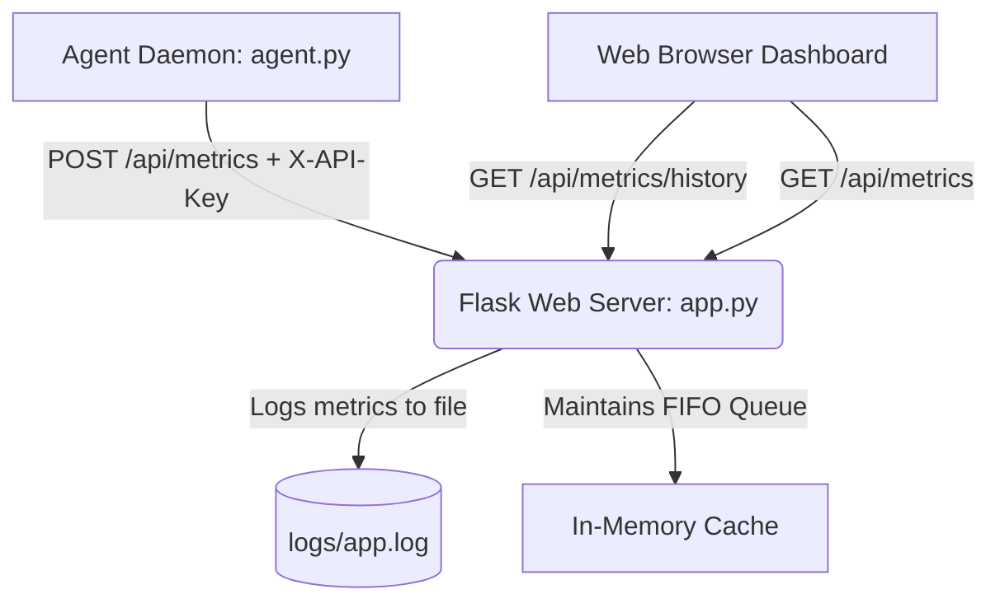

# Sys-Monitor

Sistema de monitoreo de métricas en tiempo real de recursos del sistema (CPU, RAM, Disco y Procesos activos) desarrollado en Python y Flask con un diseño frontend premium en modo oscuro y claro.

---

## 🏗️ Arquitectura del Sistema

El sistema utiliza un diseño desacoplado que separa la recolección, el servidor de la API y la capa de presentación:



1. **Agente Recolector (`agent.py`)**: Script liviano e inmune a caídas que lee métricas con la librería `psutil` y realiza peticiones POST a la API utilizando una clave de seguridad.
2. **Servidor API (`app.py`)**: Servidor Flask que recibe datos del agente, valida llaves de seguridad y mantiene una cola circular en memoria (`metrics_history`) con los últimos 20 estados. También expone las métricas del host local a través de llamadas directas.
3. **Dashboard Web (`templates/dashboard.html`)**: Interfaz responsive construida con CSS variables, tema intercambiable Claro/Oscuro, Glassmorphism estético verde bosque, y visualización de tendencias dinámica usando **Chart.js**.

---

## 🔌 Documentación de Endpoints API

### 1. `GET /api/health`
Verifica el estado del servidor.
* **Respuesta (200 OK)**:
  ```json
  {
    "status": "ok",
    "timestamp": "2026-06-22T20:13:04Z"
  }
  ```

### 2. `POST /api/metrics`
Registra un nuevo estado de métricas recolectado por el agente.
* **Cabeceras Obligatorias**: `X-API-Key: <tu-key>`
* **Cuerpo JSON**:
  ```json
  {
    "cpu": { "percent": 12.5, "cores": 8, "temperature": 43.5, "error": null },
    "memory": { "total": 16000000, "used": 8000000, "free": 8000000, "percent": 50.0, "error": null },
    "disk": { "total": 500000000, "used": 250000000, "free": 250000000, "percent": 50.0, "error": null },
    "processes": [
      { "pid": 124, "name": "python", "cpu_percent": 8.5, "memory_percent": 1.2 }
    ]
  }
  ```
* **Respuestas**:
  * `201 Created`: Métricas almacenadas en el historial.
  * `401 Unauthorized`: API Key ausente o inválida.

### 3. `GET /api/metrics`
Obtiene las métricas actuales calculadas en el host local o el último valor ingresado en caché.
* **Respuesta (200 OK)**: Retorna un objeto JSON con métricas, alertas activas (según los umbrales de advertencia en `config.py`) y el estado general (`healthy` o `warning`).

### 4. `GET /api/metrics/history`
Obtiene la lista con los últimos 20 snapshots guardados en memoria FIFO.
* **Respuesta (200 OK)**: Array de objetos de métricas.

---

## 🗺️ Roadmap de Funcionalidades

- [x] Agente de fondo desacoplado con reintentos y tolerancia a fallos.
- [x] Endpoints para precarga de gráficos (`/api/metrics/history`) y comprobación de salud (`/api/health`).
- [x] Integración de variables CSS y cambio dinámico a Modo Claro.
- [x] Logging estructurado persistido en archivo `logs/app.log`.
- [x] Filtrado de procesos del sistema para monitorear solo procesos de usuario.
- [ ] Implementar base de datos persistente (PostgreSQL / TimescaleDB) para series temporales.
- [ ] Añadir envío de notificaciones automáticas vía email o Slack cuando se activen las alertas.
- [ ] Configurar contenedores de Docker en un archivo `docker-compose.yml`.

---

## ⚙️ Guía de Ejecución y Pruebas

Ver los pasos para instalar dependencias y ejecutar en el archivo [walkthrough.md](file:///Users/diegoduronteoichin/.gemini/antigravity-ide/brain/bf48cf4e-14b7-44c2-aa9f-b0d174866b97/walkthrough.md).
