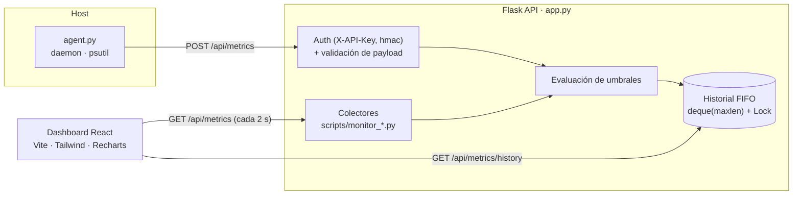

# Sys-Monitor

[](https://github.com/DiegoTepichin/sys-monitor/actions/workflows/ci.yml)


Monitoreo de recursos del host en tiempo real: un **agente** ligero recolecta CPU, memoria,
disco, red y procesos con `psutil`; una **API Flask** autenticada valida, evalúa umbrales y
conserva un historial acotado; un **dashboard React** visualiza todo con refresco cada 2 s.

---

## El problema

Cuando un servicio se degrada, la primera pregunta es _"¿qué está pasando en la máquina?"_.
Herramientas como Prometheus + Grafana resuelven esto a escala, pero son pesadas para un
servidor pequeño, un homelab o un entorno de desarrollo. Sys-Monitor ofrece:

- **Visibilidad inmediata** de CPU, RAM, swap, disco (uso y throughput), red y top procesos.
- **Alertas por umbral** configurables (CPU / memoria / disco) con estado `healthy` / `warning`.
- **Ingesta autenticada** para que agentes reporten métricas por HTTP.
- **Un solo contenedor** para desplegar: `docker compose up` y listo.

---

## Arquitectura


```mermaid
flowchart LR
    subgraph Host
        A["agent.py<br/>daemon · psutil"]
    end

    subgraph Server["Flask API · app.py"]
        V["Auth (X-API-Key, hmac)<br/>+ validación de payload"]
        T["Evaluación de umbrales"]
        H[("Historial FIFO<br/>deque(maxlen) + Lock")]
        C["Colectores<br/>scripts/monitor_*.py"]
    end

    U["Dashboard React<br/>Vite · Tailwind · Recharts"]

    A -- "POST /api/metrics" --> V --> T --> H
    U -- "GET /api/metrics (cada 2 s)" --> C --> T
    U -- "GET /api/metrics/history" --> H
```

| Componente             | Responsabilidad                                                                                                                                                                                                                         |
| ---------------------- | --------------------------------------------------------------------------------------------------------------------------------------------------------------------------------------------------------------------------------------- |
| `scripts/monitor_*.py` | Colectores puros. **Nunca lanzan excepciones**: siempre devuelven un `dict` con clave `error`, para que un sensor caído no tumbe el servicio. Disco y red calculan throughput con deltas de contadores protegidos por `threading.Lock`. |
| `agent.py`             | Daemon que recolecta cada `POLL_INTERVAL` s y hace `POST` autenticado. Tolera caídas del servidor (reintenta en el siguiente ciclo).                                                                                                    |
| `app.py`               | API Flask: autenticación en tiempo constante, validación de esquema, evaluación de umbrales, historial acotado thread-safe y servido del SPA en producción.                                                                             |
| `frontend/`            | Dashboard React 19 en bento grid: tarjetas KPI animadas, gráfica de tendencia CPU/RAM y tabla de procesos con búsqueda.                                                                                                                 |

```
sys-monitor/
├── app.py                 # API Flask + servido del SPA
├── agent.py               # Daemon recolector
├── config.py              # Configuración por env/.env con defaults seguros
├── scripts/               # Colectores psutil (cpu, memory, disk, network, processes)
├── tests/                 # pytest: API + colectores (psutil mockeado)
├── frontend/              # React 19 + Vite + Tailwind
├── Dockerfile             # Multi-stage: build Node → runtime Python con gunicorn
├── docker-compose.yml
└── .github/workflows/     # CI: ruff, pytest (3.11/3.12), oxlint, build, docker
```

---

## Stack y decisiones técnicas

| Decisión                           | Por qué                                                                                                                                |
| ---------------------------------- | -------------------------------------------------------------------------------------------------------------------------------------- |
| **Flask** sobre FastAPI/Django     | La superficie es de 4 endpoints síncronos; Flask minimiza dependencias y arranque. `psutil` es bloqueante, así que async no aportaría. |
| **psutil**                         | Abstracción multiplataforma (Linux, macOS, Windows) sobre `/proc`, `sysctl` y WMI.                                                     |
| **Agente separado del servidor**   | Desacopla recolección y presentación: el servidor puede recibir métricas de otros procesos u hosts.                                    |
| **`deque(maxlen)` + `Lock`**       | Historial O(1) acotado en memoria, seguro con servidores multi-hilo. Sin base de datos que operar.                                     |
| **`hmac.compare_digest`**          | Comparación de la API key en tiempo constante (evita ataques de timing).                                                               |
| **gunicorn, 1 worker × 4 threads** | El historial vive en memoria del proceso; varios workers lo fragmentarían. Los threads dan concurrencia.                               |
| **Colectores que nunca lanzan**    | Degradación elegante: un sensor sin soporte (p. ej. temperatura en macOS) se reporta como alerta, no como 500.                         |
| **React + Vite + Tailwind**        | HMR rápido en desarrollo; en producción Flask sirve el build estático, sin servidor Node.                                              |
| **Config sin `python-dotenv`**     | `config.py` lee `.env` manualmente y `safe_int()` recupera defaults ante valores inválidos.                                            |

---

## Inicio rápido

### Opción A — Docker (producción)

```sh
export API_KEY="$(openssl rand -hex 32)"
docker compose up --build
```

Abre <http://localhost:5002>. La imagen compila el dashboard, lo sirve desde Flask/gunicorn,
corre como usuario sin privilegios e incluye `HEALTHCHECK` contra `/api/health`.

> Dentro de un contenedor, `psutil` reporta las métricas **del contenedor**. Para monitorear el
> host completo, usa la opción B directamente en la máquina.

### Opción B — Desarrollo local

Requisitos: Python 3.11+, Node 22+.

```sh
# Backend
python -m venv venv && source venv/bin/activate
pip install -r requirements-dev.txt
cp .env.example .env            # y define un API_KEY propio
python app.py                   # API en http://127.0.0.1:5002

# Agente (otra terminal)
python agent.py

# Frontend (otra terminal)
cd frontend && npm ci && npm run dev   # http://localhost:3000, proxy /api → :5002
```

### Variables de entorno

| Variable                                                | Default                    | Descripción                                                                           |
| ------------------------------------------------------- | -------------------------- | ------------------------------------------------------------------------------------- |
| `API_KEY`                                               | `sys-monitor-secret-token` | Clave para `POST /api/metrics`. **Cámbiala**: se imprime un aviso si usas el default. |
| `HOST` / `PORT`                                         | `0.0.0.0` / `5002`         | Bind del servidor de desarrollo.                                                      |
| `DEBUG`                                                 | `False`                    | Activa el debugger de Werkzeug. Nunca en una interfaz pública.                        |
| `POLL_INTERVAL`                                         | `5`                        | Segundos entre envíos del agente.                                                     |
| `HISTORY_LIMIT`                                         | `20`                       | Snapshots retenidos en memoria.                                                       |
| `CPU_THRESHOLD` / `MEMORY_THRESHOLD` / `DISK_THRESHOLD` | `80` / `85` / `90`         | Porcentajes que disparan alertas.                                                     |
| `LOG_FILE`                                              | `logs/app.log`             | Log rotativo (5 MB × 3).                                                              |
| `FRONTEND_DEV_URL`                                      | `http://localhost:3000`    | Destino de `/` cuando no existe `frontend/dist`.                                      |

---

## API

| Método | Ruta                   | Auth        | Descripción                                                                      |
| ------ | ---------------------- | ----------- | -------------------------------------------------------------------------------- |
| `GET`  | `/api/health`          | —           | Liveness: `{"status": "ok", "timestamp": "..."}`                                 |
| `GET`  | `/api/metrics`         | —           | Snapshot en vivo del host del servidor, con alertas y `status`.                  |
| `POST` | `/api/metrics`         | `X-API-Key` | Ingesta desde un agente. `201` ok · `400` payload inválido · `403` key inválida. |
| `GET`  | `/api/metrics/history` | —           | Últimos `HISTORY_LIMIT` snapshots normalizados (más antiguo primero).            |

```sh
curl -X POST http://localhost:5002/api/metrics \
  -H "X-API-Key: $API_KEY" -H "Content-Type: application/json" \
  -d '{"cpu":{"percent":12.5},"memory":{"percent":48.1},"disk":{"percent":61.0}}'
```

`cpu`, `memory` y `disk` son obligatorios y su `percent` debe ser numérico en `[0, 100]`.
`network`, `processes` y `timestamp` son opcionales; cada snapshot se normaliza a una forma
estable antes de guardarse.

---

## Rendimiento

Medido con el test client de Flask en un Apple M4 (in-process, sin red):

| Operación                                              | p50     | p95    |
| ------------------------------------------------------ | ------- | ------ |
| `POST /api/metrics` (validación + umbrales + registro) | 0.44 ms | 2.7 ms |
| `GET /api/metrics/history` (20 snapshots, ~22 KB)      | 0.34 ms | 1.1 ms |
| `GET /api/metrics` (recolección en vivo)               | 160 ms  | 197 ms |

La recolección en vivo está dominada por `psutil.cpu_percent(interval=0.1)`, que muestrea
100 ms de forma bloqueante, más la iteración de procesos. Un snapshot pesa ~1.2 KB.

### Escalabilidad y límites conocidos

- **Estado en memoria**: el historial se pierde al reiniciar y no se comparte entre workers.
  El siguiente paso natural es una base de series temporales (TimescaleDB, o SQLite con
  retención) para habilitar múltiples workers y consultas históricas.
- **Un solo host en el dashboard**: los snapshots de agentes se guardan en el historial, pero el
  dashboard grafica el muestreo en vivo del servidor. Etiquetar snapshots por `host_id`
  habilitaría vistas multi-host.
- **Umbrales duplicados**: el frontend define sus propios umbrales visuales; exponerlos desde la
  API evitaría desalineación.
- **Bundle del frontend** ~700 KB (Recharts + Framer Motion); candidato a code-splitting.

---

## Calidad y buenas prácticas

- **25 tests** con `pytest` (psutil mockeado): autenticación, validación, límites del historial,
  umbrales, errores de sensores, throughput de red y ranking de procesos.
- **CI** en GitHub Actions: `ruff check`, `ruff format --check`, `pytest` en Python 3.11 y 3.12,
  `oxlint` + build del frontend y build de la imagen Docker.
- **pre-commit**: ruff, prettier y checks de higiene de archivos.
- **Seguridad**: comparación de claves en tiempo constante, `DEBUG` desactivado por defecto,
  errores internos no se exponen al cliente, contenedor sin root, `API_KEY` obligatoria en
  compose.
- **Observabilidad**: logs rotativos; INFO reservado para eventos de ciclo de vida y seguridad.

---

## Roadmap

- [x] Agente desacoplado con tolerancia a fallos
- [x] Dashboard React con tendencias y búsqueda de procesos
- [x] Docker multi-stage con healthcheck y usuario sin privilegios
- [x] CI (lint, tests, build)
- [ ] Persistencia en base de series temporales
- [ ] Soporte multi-host (`host_id` por snapshot)
- [ ] Notificaciones de alertas (Slack / email)
- [ ] Streaming por Server-Sent Events en lugar de polling

---

## Contribuir

Consulta [CONTRIBUTING.md](CONTRIBUTING.md) para el flujo de trabajo, convenciones y comandos.
