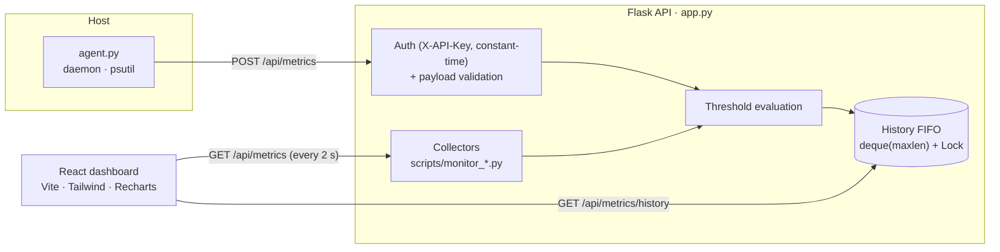

**English** | [Español](README.es.md)

# Sys-Monitor

Real-time host monitoring: a `psutil` agent, an authenticated Flask API and a React dashboard.

[](https://github.com/DiegoTepichin/sys-monitor/actions/workflows/ci.yml)


[](LICENSE)

<!-- TODO: screenshot — add docs/screenshot.png and uncomment the line below -->
<!--  -->

## Why

When a machine slows down, the first question is _"what is it doing right now?"_. Prometheus +
Grafana answer that at scale, but they are a lot to run for a single server, a homelab or a dev
box. Sys-Monitor is a small, self-contained alternative:

- **Live view** of CPU (usage, load average, frequency), memory and swap, disk usage and
  read/write throughput, network throughput and the top processes by CPU.
- **Threshold alerts** for CPU, memory and disk, with an overall `healthy` / `warning` status.
- **Authenticated ingestion**: an agent pushes snapshots over HTTP with an API key.
- **One container** for deployment: `docker compose up`.

## Architecture


```mermaid
flowchart LR
    subgraph Host
        A["agent.py<br/>daemon · psutil"]
    end

    subgraph Server["Flask API · app.py"]
        V["Auth (X-API-Key, constant-time)<br/>+ payload validation"]
        T["Threshold evaluation"]
        H[("History FIFO<br/>deque(maxlen) + Lock")]
        C["Collectors<br/>scripts/monitor_*.py"]
    end

    U["React dashboard<br/>Vite · Tailwind · Recharts"]

    A -- "POST /api/metrics" --> V --> T --> H
    U -- "GET /api/metrics (every 2 s)" --> C --> T
    U -- "GET /api/metrics/history" --> H
```

| Component              | Responsibility                                                                                                                                                                                                   |
| ---------------------- | ---------------------------------------------------------------------------------------------------------------------------------------------------------------------------------------------------------------- |
| `scripts/monitor_*.py` | Collectors. They **never raise**: each returns a dict with an `error` key, so one failing sensor can't take the service down. Disk and network compute throughput from counter deltas behind a `threading.Lock`. |
| `agent.py`             | Daemon that collects every `POLL_INTERVAL` seconds and POSTs with `X-API-Key`. Survives server outages and retries on the next cycle.                                                                            |
| `app.py`               | Flask API: constant-time key check, schema validation, threshold alerts, bounded thread-safe history, and serves the built dashboard in production.                                                              |
| `frontend/`            | React 19 dashboard: animated KPI cards, CPU/RAM trend chart and a searchable process table.                                                                                                                      |

## Quickstart

Requirements: Python 3.11+, Node 22+.

```sh
git clone https://github.com/DiegoTepichin/sys-monitor.git && cd sys-monitor
python3 -m venv venv && source venv/bin/activate && pip install -r requirements.txt
(cd frontend && npm ci && npm run build)
echo "API_KEY=$(openssl rand -hex 32)" > .env
python app.py & python agent.py
```

Open <http://localhost:5002>. Flask serves the built dashboard; the agent pushes a snapshot every
5 seconds. Stop both with `Ctrl+C` followed by `kill %1`.

For frontend development with hot reload, run `cd frontend && npm run dev` and open
<http://localhost:3000> (Vite proxies `/api` to `:5002`).

### Docker

```sh
docker compose up --build
```

Open <http://localhost:5002>. The image builds the dashboard, runs it under gunicorn as a
non-root user and defines a `HEALTHCHECK` on `/api/health`.

> Inside a container, `psutil` sees the **container**, not the host: expect only a couple of
> processes. To monitor a real machine, use the local quickstart on it.

## Tests

```sh
pip install -r requirements-dev.txt
pytest                                   # 26 tests, psutil is mocked
ruff check . && ruff format --check .
cd frontend && npm run lint && npm run build
```

CI runs all of the above on every push (pytest on Python 3.11 through 3.14) and also builds the
Docker image.

## API

| Method | Path                   | Auth        | Description                                                                                       |
| ------ | ---------------------- | ----------- | ------------------------------------------------------------------------------------------------- |
| `GET`  | `/api/health`          | —           | Liveness: `{"status": "ok", "timestamp": "..."}`                                                  |
| `GET`  | `/api/metrics`         | —           | Live snapshot of the server host, with alerts and `status`.                                       |
| `POST` | `/api/metrics`         | `X-API-Key` | Agent ingestion. `201` stored · `400` invalid payload · `403` wrong key · `503` no `API_KEY` set. |
| `GET`  | `/api/metrics/history` | —           | Last `HISTORY_LIMIT` normalized snapshots, oldest first.                                          |

```sh
curl -X POST http://localhost:5002/api/metrics \
  -H "X-API-Key: $API_KEY" -H "Content-Type: application/json" \
  -d '{"cpu":{"percent":12.5},"memory":{"percent":48.1},"disk":{"percent":61.0}}'
```

`cpu`, `memory` and `disk` are required, each with a numeric `percent` in `[0, 100]`.
`network`, `processes` and `timestamp` are optional.

## Configuration

Set in `.env` (see [`.env.example`](.env.example)) or as environment variables; environment
variables win.

| Variable                                                | Default                 | Description                                                                   |
| ------------------------------------------------------- | ----------------------- | ----------------------------------------------------------------------------- |
| `API_KEY`                                               | _(none)_                | Required for `POST /api/metrics` and the agent. Without it, ingestion is off. |
| `HOST` / `PORT`                                         | `0.0.0.0` / `5002`      | Bind address for `python app.py`.                                             |
| `DEBUG`                                                 | `False`                 | Werkzeug debugger. Never enable on a public interface.                        |
| `POLL_INTERVAL`                                         | `5`                     | Seconds between agent pushes.                                                 |
| `HISTORY_LIMIT`                                         | `20`                    | Snapshots kept in memory.                                                     |
| `CPU_THRESHOLD` / `MEMORY_THRESHOLD` / `DISK_THRESHOLD` | `80` / `85` / `90`      | Percentages that trigger alerts.                                              |
| `LOG_FILE`                                              | `logs/app.log`          | Rotating log file (5 MB × 3).                                                 |
| `FRONTEND_DEV_URL`                                      | `http://localhost:3000` | Where `/` redirects when no `frontend/dist` build exists.                     |

## Key technical decisions

| Decision                           | Why                                                                                                              |
| ---------------------------------- | ---------------------------------------------------------------------------------------------------------------- |
| **Flask** over FastAPI             | Four synchronous endpoints and a blocking library (`psutil`): async would add complexity without benefit.        |
| **Agent separate from the API**    | Collection and presentation are decoupled; anything that can send HTTP can report metrics.                       |
| **`deque(maxlen)` + `Lock`**       | O(1) bounded history that is safe under a threaded server, with no database to operate.                          |
| **No default API key**             | A built-in fallback token would be public on GitHub. Ingestion stays off until a key is configured.              |
| **`hmac.compare_digest`**          | Constant-time key comparison, so response timing doesn't leak the key.                                           |
| **gunicorn, 1 worker × 4 threads** | History lives in process memory; multiple workers would each hold a different copy. Threads provide concurrency. |
| **Collectors never raise**         | Graceful degradation: an unsupported sensor (e.g. temperature on macOS) becomes an alert, not a 500.             |
| **Flask serves the built SPA**     | One process and one port in production, with no Node server.                                                     |

## Performance

Measured in-process with Flask's test client on an Apple M4 (Python 3.14, no network):

| Operation                                       | p50     | p95     |
| ----------------------------------------------- | ------- | ------- |
| `POST /api/metrics` (validate + alerts + store) | 0.32 ms | 0.86 ms |
| `GET /api/metrics/history` (20 snapshots)       | 0.29 ms | 0.70 ms |
| `GET /api/metrics` (live collection)            | 140 ms  | 187 ms  |

Live collection is dominated by `psutil.cpu_percent(interval=0.1)`, which blocks for 100 ms to
sample CPU usage, plus process iteration.

## Known limitations

- **In-memory state**: history is lost on restart and isn't shared across workers.
- **Single host in the dashboard**: agent snapshots are stored in history, but the dashboard
  charts the server's own live sampling. There is no `host_id` yet.
- **Duplicated thresholds**: the dashboard's card colors use their own hardcoded thresholds.
- **Bundle size**: ~700 KB minified JS (~210 KB gzipped), mostly Recharts and Framer Motion.

## Roadmap

- [ ] Persist history in a time-series store
- [ ] Multi-host support (`host_id` per snapshot)
- [ ] Alert notifications (Slack / email)
- [ ] Server-Sent Events instead of polling

## Contributing

See [CONTRIBUTING.md](CONTRIBUTING.md) and [docs/ENGINEERING.md](docs/ENGINEERING.md).

## License

[MIT](LICENSE)

---

Built by [Diego Tepichin](https://github.com/DiegoTepichin) — Systems Engineer · Founder of CAFE
